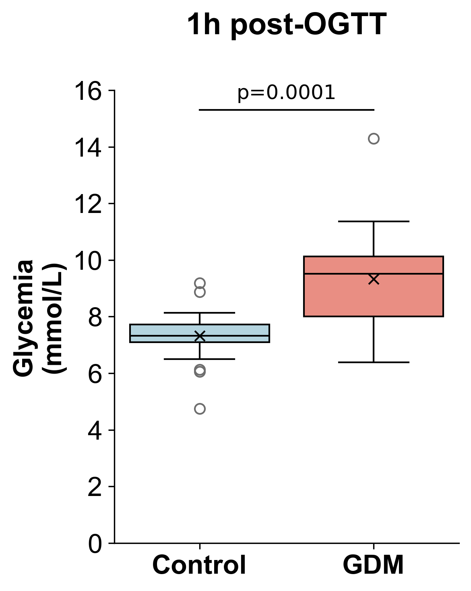
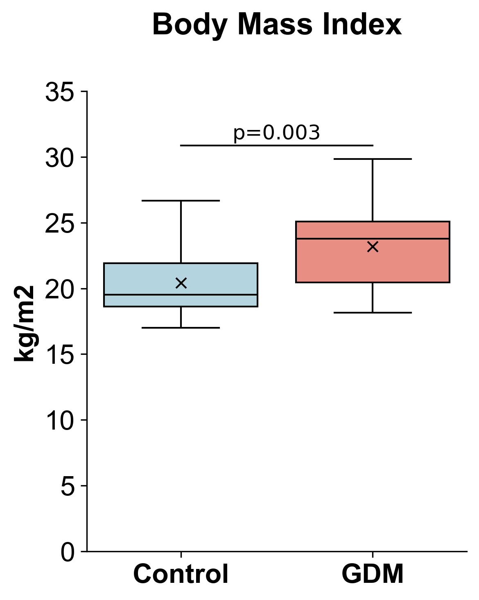
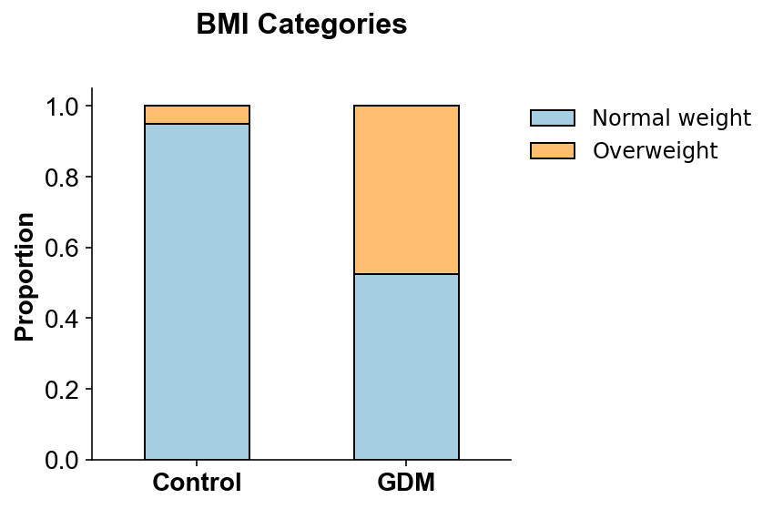
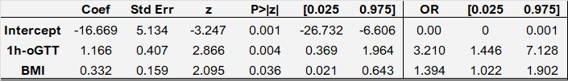
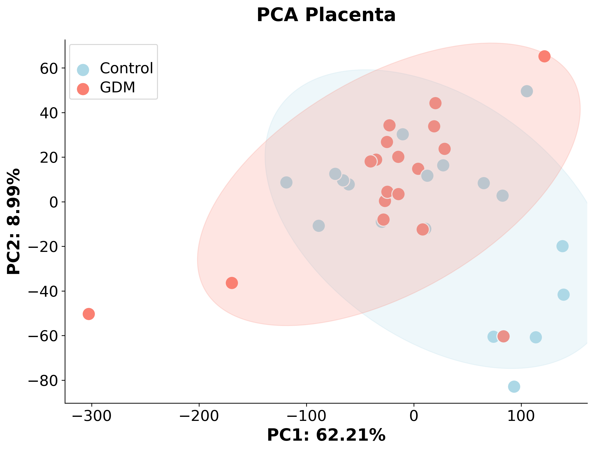
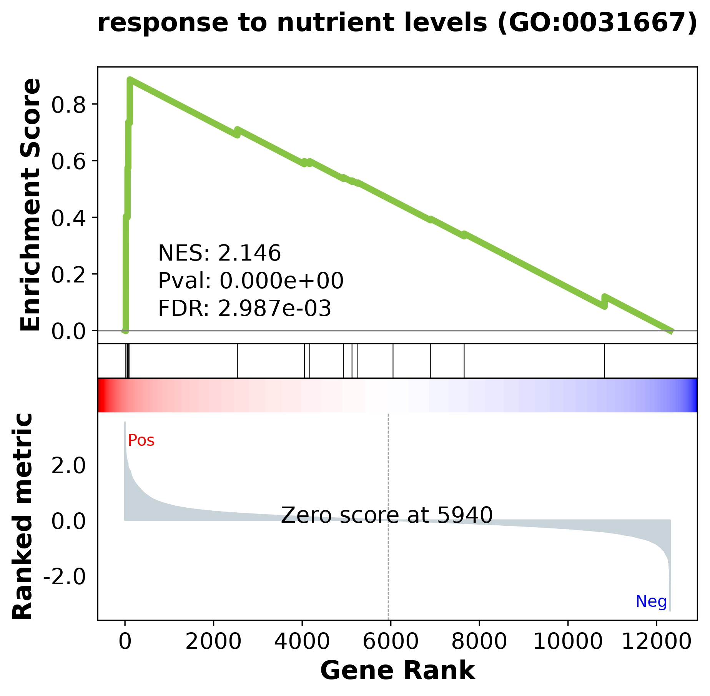
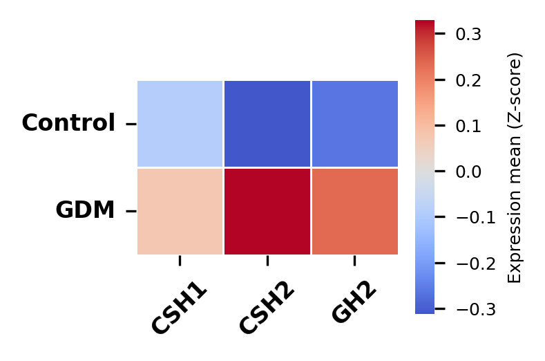
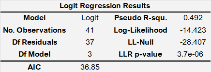
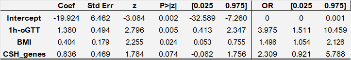

# 🧬 Integration of Clinical and Molecular Factors in the Risk Assessment for Gestational Diabetes Mellitus

---
❗ *The data presented here are preliminary results from an ongoing study. A manuscript is currently being prepared for publication in a scientific journal.*

---
## 📖 Summary
This research investigates the potential of integrating **clinical data with placental transcriptomics** to improve risk assessment for Gestational Diabetes Mellitus (GDM).  

- Traditional clinical factors remain strong predictors.  
- Placental molecular signatures reveal new biological insights.  
- The integrated model shows improved predictive performance.  

---

## ❓ Problem
GDM is a **multifactorial metabolic disorder** posing risks to both mother and fetus.  

- Diagnosis relies on the **OGTT**, which has limitations.  
- Clinical factors like pre-gestational **BMI** capture only part of the risk.  
- **Placenta** plays a crucial role in maternal metabolic adaptation, but is underexplored in risk models.  

This study addresses whether combining **placental molecular data** with **clinical parameters** yields a more robust model.

---

## 🧪 Methodology

**Dataset**: GEO repository, 41 pregnant women (21 GDM, 20 controls).  

- 🩺 **Clinical Data**: Python (Pandas, Statsmodels). Missing values handled by MICE. BMI calculated and categorized.  
- 🔬 **Transcriptomics**: Bulk RNA-seq pipeline → filtering, log2(CPM+1), Z-score scaling, PCA.  
- 🎯 **DEG Analysis**: limma (R via rpy2 in Python), with voom transformation.  
- 📊 **Enrichment Analysis**: GSEA using Gseapy.  
- 📈 **Modeling**: Logistic Regression (Statsmodels), with VIF & Pearson for multicollinearity, and simulated envelopes for fit.  
- 🧾 **Transcriptomic Score**: CSH1 + CSH2 Z-scores combined.  

---

## 💻 Skills

- 🐍 **Python (v3.12.3)** → Pandas, Numpy, Statsmodels, Scikit-learn, SciPy, Gseapy, Matplotlib, Seaborn, rpy2  
- 📊 **R (v4.5.1)** → limma-voom, hnp  
- 📈 **Statistics** → Logistic Regression, MICE, VIF, Half-Normal Plots  
- 🔬 **Bioinformatics** → RNA-seq, DEG, GSEA  

---

## 📊 Results

### Clinical Analysis

##### Group Characterization

  
  
  

##### Logistic Regression Results

  

  

> The logistic regression model was well fitted and statistically significant.  
> For each **1-unit increase in BMI**, the odds of developing GDM increased by **1.39** (OR = 1.39). For each **1 mmol/L increase in 1-hour glycemia**, the odds increased by **3.21** (OR = 3.21).

### Transcriptomic Analysis
From placentas of patients diagnosed with gestational diabetes or from control subjects.

> A distinct molecular signature of *“response to nutrient levels” (GO:0031667)* was identified in the placentas of women with GDM.  
> This was characterized by the significant upregulation of genes from the **Chorionic Somatomammotropin Hormone (CSH) group**, responsible for producing **placental lactogen (PL)**.

| PCA | GSEA 
|-----|------|
|  |  

| CSH Expression|
|---|
|  |

##### Integrated Model

>Although the CSH gene score was not statistically significant on its own (p = 0.074), including it in the clinical model led to a **better overall fit**, as shown by a lower AIC (36.85 vs. 39.00). Moreover, it increased the effect size of the clinical predictors, with the odds ratio (OR) for Glycemia rising to 3.97 and for BMI to 1.49.

  

  

---

## 📝 Conclusion
- Clinical risk factors (**BMI, glycemia**) remain strong predictors of GDM.  
- **Placental lactogen signature (CSH genes)** adds biological depth and improves model fit.  
- This suggests **placental lactogen** could serve as a **biomarker** for better GDM diagnosis and management.  

---

## 🔮 Next Steps
- 📈 **Validation** → Larger, more diverse cohorts.  
- 🕐 **Prospective Studies** → Test early pregnancy predictive value.  
- 🧪 **Serum Biomarker Development** → Translate placental transcriptomic signature into non-invasive clinical tools.  

---

